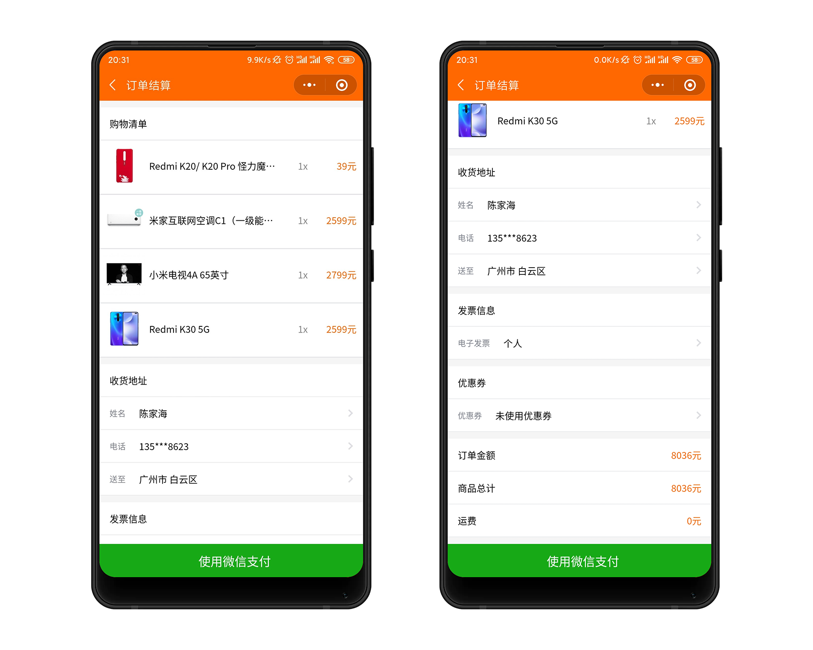
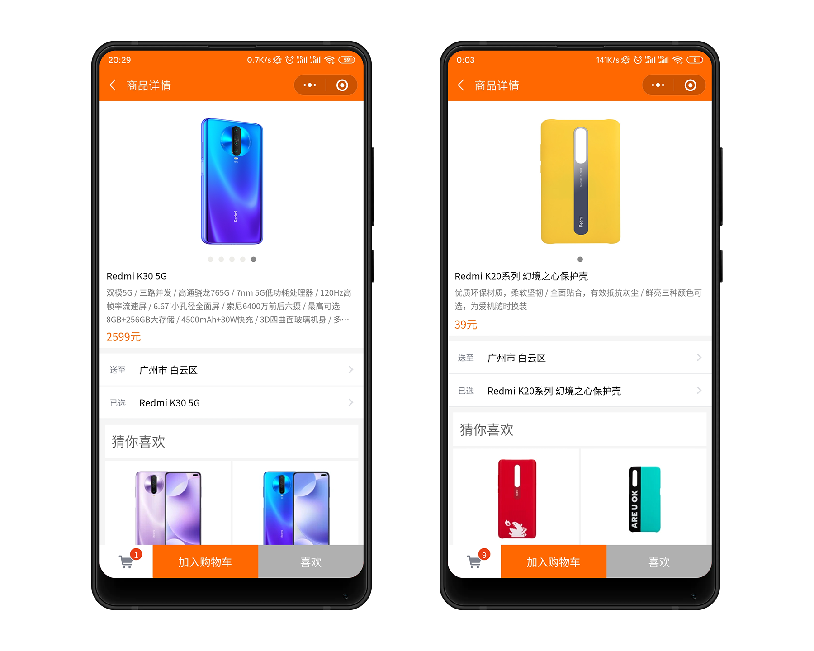
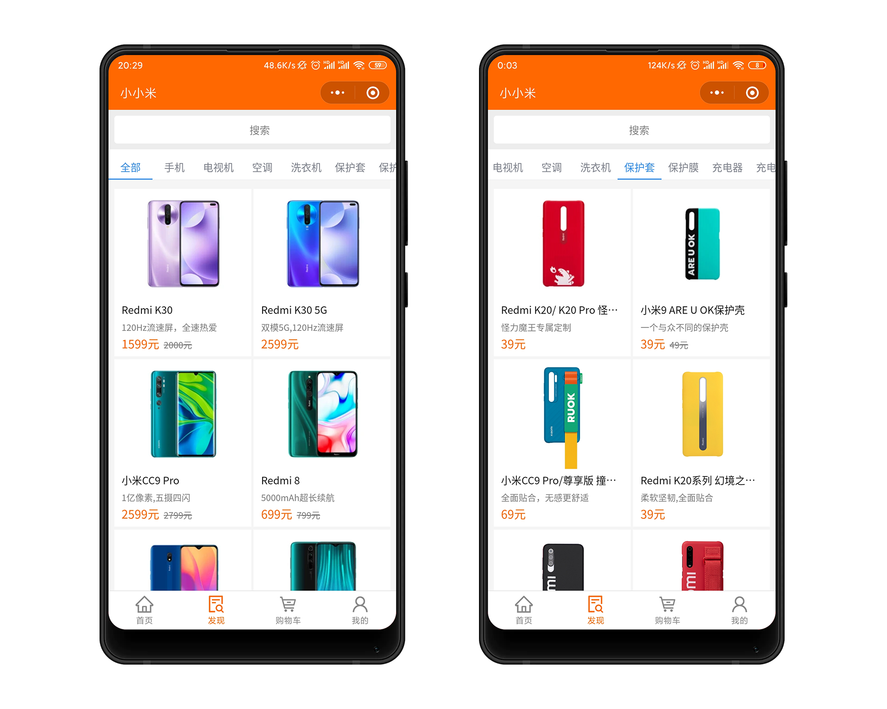
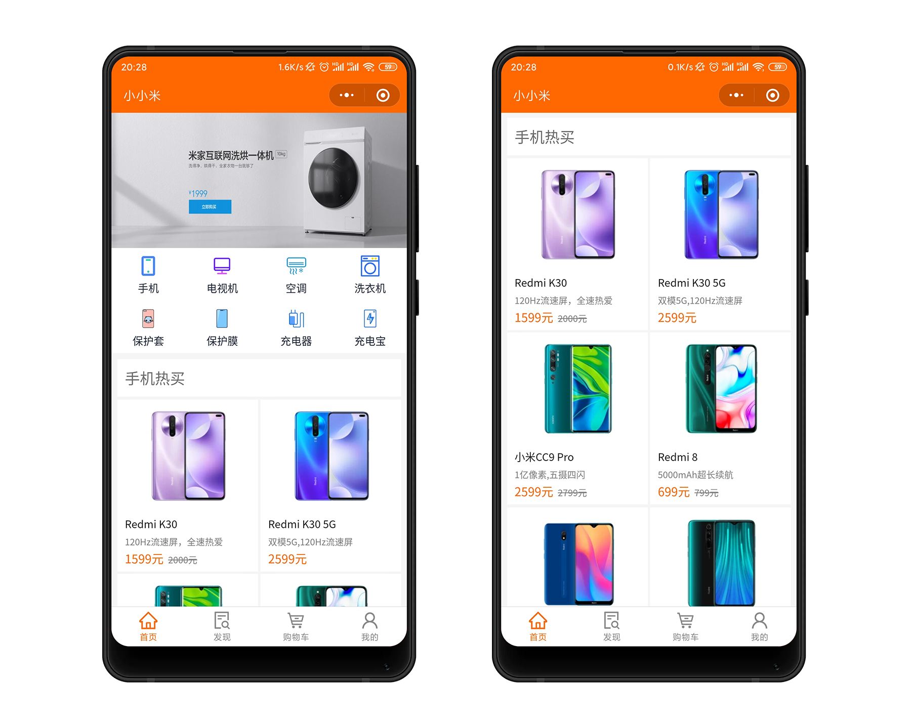
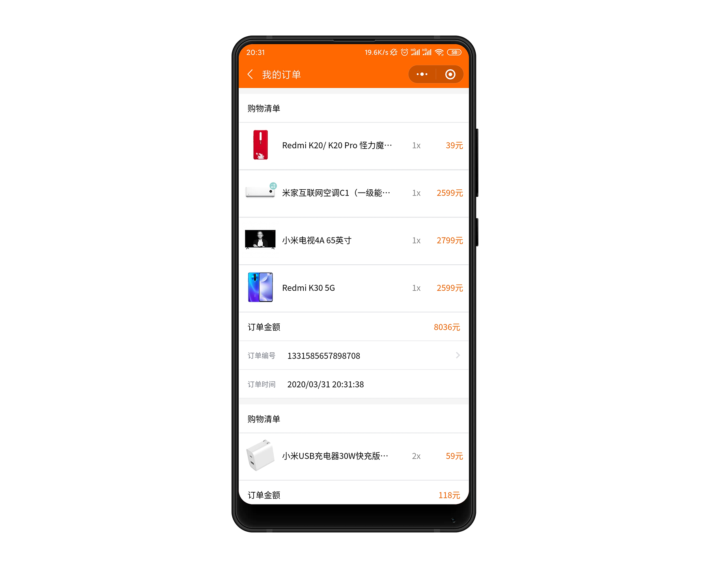
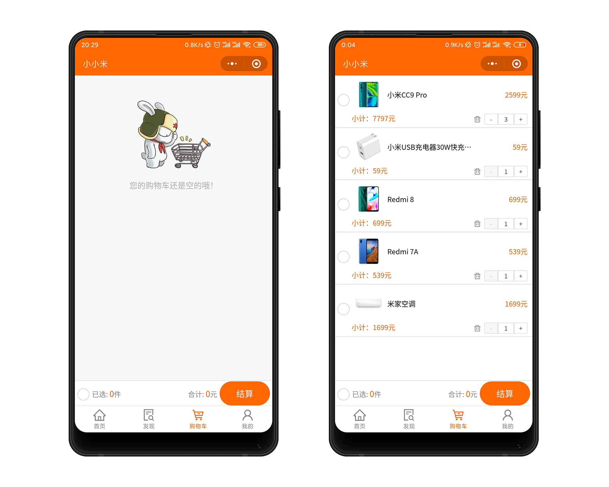

# store-H5

Vue3 + TS + vite + Pinia + tailwindcss 开发移动端商城项目

## 项目截图
| 我的收藏  | 确认订单  | 详情页  |
| ----------------------------------------------------- | ----------------------------------------------------------- | ------------------------------------------ |

| 商品分类  | 我的  | 订单  |
| ------------------------------------------------------ | ------------------------------------------------------------ | -------------------------------------------------- |

| 购物车  
| ----------------------------------------- |

### 安装依赖
```bsah
npm install
```

### 启动
```bsah
yarn dev
```

## Git提交规范
```
'feat',//新特性、新功能
'fix',//修改bug
'docs',//文档修改
'style',//代码格式修改, 注意不是 css 修改
'refactor',//代码重构
'perf',//优化相关，比如提升性能、体验
'test',//测试用例修改
'chore',//其他修改, 比如改变构建流程、或者增加依赖库、工具等
'revert',//回滚到上一个版本
'build',//编译相关的修改，例如发布版本、对项目构建或者依赖的改动
```
